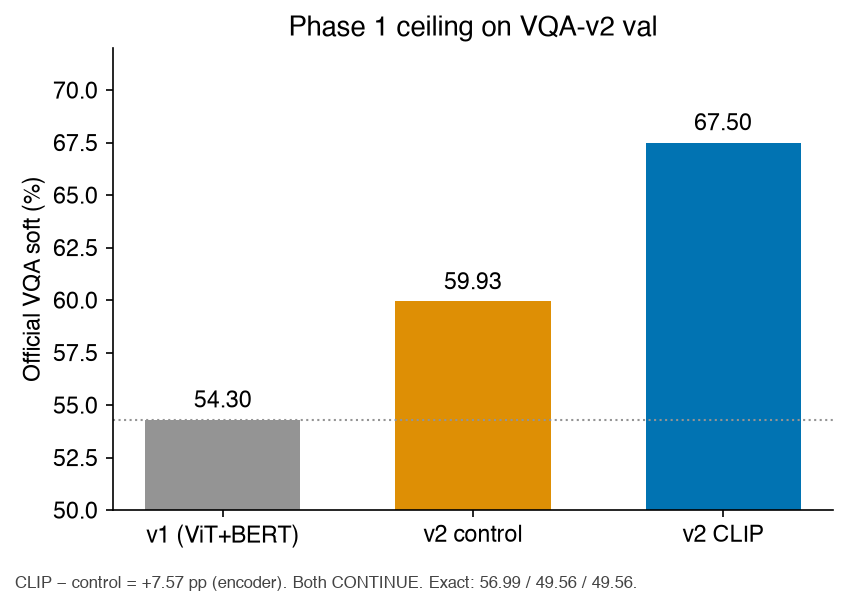
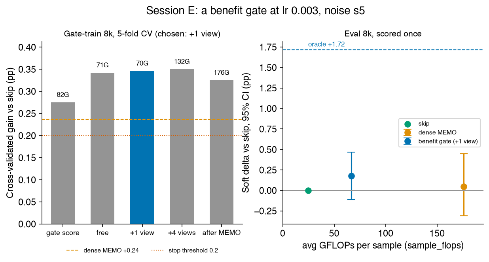
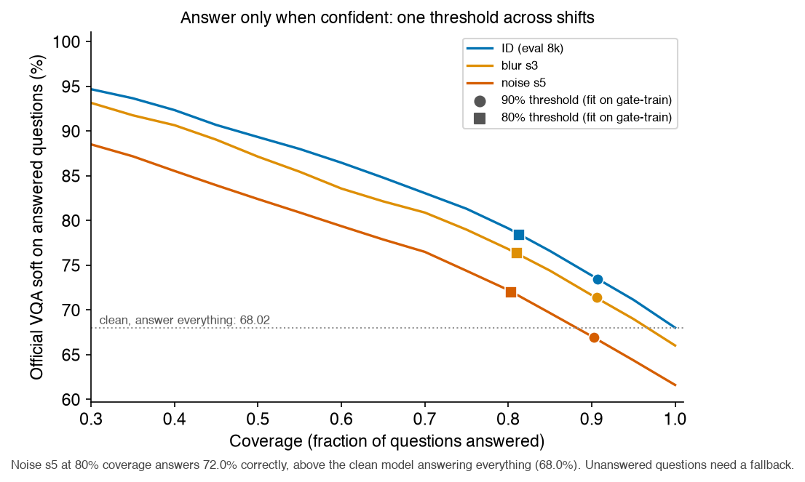

# AdaTTT — when does test-time adaptation help VQA under distribution shift?

[](https://github.com/Yugesh-reddy/AdaTTT-Adaptive-Test-Time-Training/actions/workflows/tests.yml)

A controlled study of a VQA model on VQA-v2 under visual corruption. It asks three questions: what limits accuracy, whether test-time adaptation (TTA) recovers what a shift takes away, and what to do if it doesn't. Every claim below comes with a confidence interval. The adaptation experiments were pre-registered, and scored on a frozen evaluation split that stayed unread until the method was committed.

Full report: [`results/writeup/REPORT.md`](results/writeup/REPORT.md).

## Results at a glance

- **The encoder was the ceiling.** Swapping frozen ViT-B/16 + BERT for CLIP ViT-B/16, with the fusion stack held fixed, lifts VQA-v2 val accuracy from **59.93 to 67.50** (+7.57 pp; +13.2 over the original model).
- **Three silent training bugs, found by inspecting gradients, optimizer state and labels.** The first run looked plausible but was broken, and all three bugs were fixed:
  - the gate's auxiliary loss outweighed the answer loss 19× on the fusion gradient;
  - `<UNK>` was a positive training target on 31% of questions;
  - the logged metric was inflated by ~17 pp.
- **Test-time adaptation doesn't recover the shift.** Gaussian noise costs 6.40 pp. MEMO-style adaptation was tested at the original step size, at a step size chosen on held-out data, and behind a pre-registered benefit gate. The best result is **+0.18 pp (95% CI −0.11 to +0.47)**. The limit is predicting *who* benefits (AUROC ≤ 0.57), not the step size; a per-sample oracle shows +1.72 pp is available.
- **What works instead: knowing when not to answer.** One confidence threshold, fit once on noisy held-out data, raises accuracy on the answered questions by **+5.3 pp at 90% coverage and +10.4 pp at 80%**. It holds across clean, blurred and noised images, at no extra compute.

| | | |
|:---:|:---:|:---:|
|  |  |  |
| Phase 1: encoder swap | Phase 2: best TTA, pre-registered | Selective prediction |

## Try it

```bash
pip install gradio
python demo/app.py            # http://127.0.0.1:7860
```

Upload an image and ask a question. The model answers, or declines when its uncertainty is above the held-out threshold — the behaviour measured in section 3. Counting questions, the classic VQA weak spot, are the ones it declines most. The frozen CLIP encoders download on first run (~600 MB); `--coverage 80` makes it more cautious and `--no-abstain` makes it always answer.

## 1. A better encoder, not a better fusion

Official VQA-v2 val (214,354 questions). The score is min(#humans/3, 1) with no credit for `<UNK>`.

| Model | Soft | Exact | Verdict |
|---|---:|---:|---|
| v1: frozen ViT-B/16 + BERT-base | 54.30 | 49.56 | — |
| v2 control: same encoders, current fusion | 59.93 | 49.56 | still improving at epoch 8 |
| **v2: frozen CLIP ViT-B/16** | **67.50** | **56.99** | still improving at epoch 8 |

The control isolates the encoder: CLIP adds **+7.57 pp soft / +7.43 pp exact** with the fusion stack unchanged.

**The bug hunt.** The first training run plateaued far below v1, and the logs looked fine. Reading the fusion's gradients and the saved AdamW state showed three problems:
- **Loss scaling.** Soft BCE averaged over 3,129 answers made the 0.1-weighted gate loss dominate the fusion gradient 19×. The fusion was learning VQA at ~3% of its nominal learning rate.
- **Target pooling.** Every out-of-vocabulary annotator answer was pooled into `<UNK>`, a positive target for 31% of questions. On a probe slice, the model answered `<UNK>` 37% of the time.
- **Metric inflation.** The logged "official" score credited those `<UNK>` answers.

Each fix is covered by a regression test (`tests/test_v2_loss.py`, `tests/test_v2_targets.py`).

## 2. Test-time adaptation under shift

Frozen 8k-question evaluation subsets under ImageNet-C corruptions: skip drops from 68.02 (clean) to 66.03 under blur s3 and 61.62 under noise s5. Adaptation updates the fusion LayerNorms per sample and resets after each one.

| Session | What changed | Result on the eval split (noise s5) |
|---|---|---|
| C | MEMO at Adam lr 1e-4 | −0.04 pp; only 45 of 8,000 answers change, on clean images as often as noised ones: the step is inert |
| D | lr chosen on held-out data (3e-3) | +0.05 pp (CI −0.31, +0.45); 584 answers change, but 174 improve and 166 get worse |
| E | gate that predicts per-sample benefit, fit on held-out data | **+0.18 pp (CI −0.11, +0.47)** at 66.7 vs 175.8 GFLOPs for dense MEMO |

The oracle, which picks the better of skip and MEMO per sample, is +1.72 pp. The recoverable gain is there, but no signal we logged (confidence, view agreement, post-adaptation entropy) predicts it above AUROC 0.57.

## 3. What works: selective prediction

The model's confidence ranks its own correctness well (AUROC 0.80–0.83). Thresholds fit on the noise-s5 held-out split, then applied unchanged:

| Eval 8k | Answer everything | 90% threshold | 80% threshold |
|---|---:|---|---|
| clean | 68.02 | 73.45 at 90.7% coverage | 78.42 at 81.3% coverage |
| blur s3 | 66.03 | 71.38 at 90.6% | 76.35 at 81.0% |
| noise s5 | 61.62 | 66.92 at 90.2% | 72.02 at 80.3% |

Every gain's 95% CI is within ±0.4–0.6 pp. Under heavy noise, answering the confident 80% beats the clean model answering everything. The unanswered questions need a fallback, such as a person or a larger model.

## How it was evaluated

- **Frozen splits.** `data/eval_subset_8k.json` is report-only. `data/gate_train_subset_8k.json` is used for every choice: step sizes, thresholds and gates.
- **Pre-registration.** Selection and stop rules live in code before each run (`ttt/phase2_session.py`, `ttt/benefit_gate.py`). The Session E scorer refuses to read the evaluation outcomes until the frozen gate spec is committed to git.
- **Deployment cost, not cache cost.** FLOPs count what a served request runs, including a backward pass through every augmented view (a ladder of 24.8 / 43.4 / 103.4 / 175.8 GFLOPs).
- **Statistics.** Paired bootstrap 95% CIs and exact McNemar tests. Results reproduce exactly across sessions.
- **Generated writeup.** Every number and figure is generated from the landed artifacts (`scripts/writeup_numbers.py`, `scripts/writeup_figures.py`), never typed by hand.

## Engineering

- **Preemption-safe Colab orchestration** (`tools/colab_orchestrator/`):
  - refreshes the runtime token before its one-hour expiry;
  - re-adopts or releases VMs the CLI loses track of;
  - relays checkpoints in sha256-verified chunks and resumes from them after preemption;
  - enforces a hard compute budget.

  It is tested against a simulated Colab in 18 failure scenarios.
- **274 tests** run in CI on CPU, with no model downloads.

## Repository

```
config/config.yaml           hyperparameters
ttt/                         models, data, losses, shifts, TTA adapters, gates, metrics
  tta.py                     MEMO and episodic TENT/EATA/SAR-style adapters
  benefit_gate.py            the pre-registered benefit gate (Session E)
  phase2_session.py          Phase 2 sessions and their fixed rules
gpu/                         training, feature caching, Phase 2 evaluation (A100)
scripts/                     ceiling check, gate fit/score, abstention, writeup generation
tools/colab_orchestrator/    Colab runner and its simulator tests
results/writeup/             report, generated numbers and figures
data/                        frozen evaluation subsets (datasets are downloaded)
tests/                       test suite
demo/app.py                  interactive demo: answer or abstain
notebooks/                   v1 notebooks
```

## Reproducing

```bash
python -m venv .venv && source .venv/bin/activate
pip install torch torchvision transformers numpy scipy pyyaml pillow tqdm matplotlib pytest
pip install -e . --no-deps
pytest tests/ -q                     # CPU only, no downloads
python scripts/writeup_figures.py    # figures from results/writeup/numbers.json
```

Training (`python gpu/train_base.py --config config/config.yaml --epochs 8`) and the Phase 2 sessions (`tools/colab_orchestrator/orch_phase2.py`) run on an A100. Their raw outputs are large and gitignored; `scripts/writeup_numbers.py` and `scripts/abstention.py` rebuild the writeup from them.

## Limitations

- **Metric.** Accuracy is min(#humans/3, 1) on raw answers, without the official evaluator's answer normalization and 10-choose-9 averaging. Numbers are consistent across this study but not leaderboard-comparable.
- **Model.** Encoders are frozen and the fusion is a two-layer cross-attention stack: a compact model, not a state-of-the-art VQA system.
- **Phase 2 scope.** 8k-question subsets and two corruption types. TTA adapts fusion LayerNorms only, and the TENT/EATA/SAR baselines are episodic single-step variants, not the published online algorithms.
- **Abstention trade-off.** Abstention leaves 10–20% of questions unanswered.

## Original course project (v1)

AdaTTT began as a CS 518 final project (Deep Learning for Computer Vision, Prof. Sathya N. Ravi, UIC) by Aishwarya Reddy Chinthalapudi, Yugesh Reddy Sappidi and Aryan Shetty. v1 introduced the confidence-gated TTT design. It found that TTT on every sample lowered accuracy, and that its gate recovered base accuracy mainly by skipping TTT. This follow-up re-examines those results.

```bibtex
@inproceedings{adattt2026,
  title     = {AdaTTT: Adaptive Test-Time Training for Visual Question Answering},
  author    = {Chinthalapudi, Aishwarya Reddy and Sappidi, Yugesh Reddy and Shetty, Aryan},
  booktitle = {CS 518 Final Project, University of Illinois Chicago},
  year      = {2026}
}
```

## Contact

Yugesh Reddy Sappidi — yugeshreddysappidi@gmail.com
