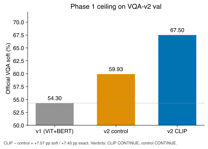
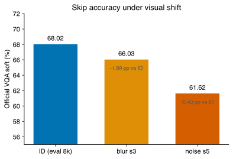
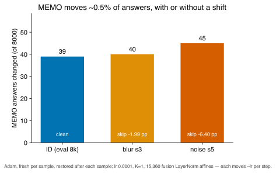
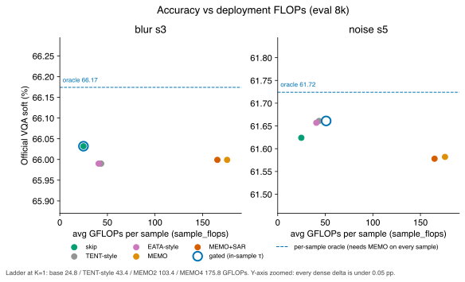
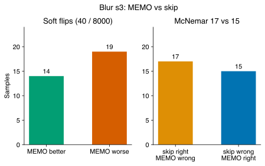
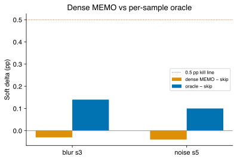
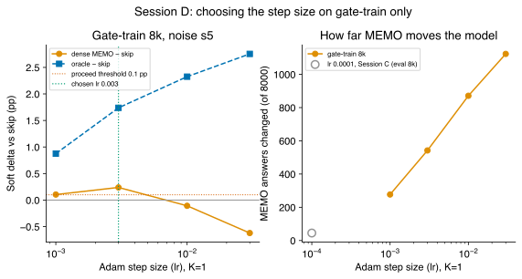
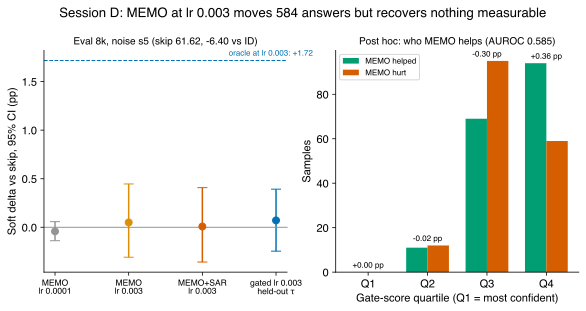
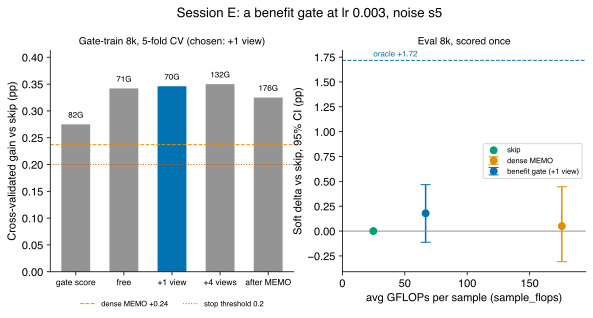
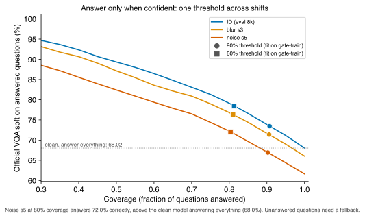

# AdaTTT writeup: a better encoder, a pre-registered TTA negative, and selective prediction

Numbers: `numbers.json`, generated by `scripts/writeup_numbers.py` from the landed artifacts (pointers in `ARTIFACTS.md`). Figures: `scripts/writeup_figures.py`.

## 1. Phase 1 — CLIP ceiling (CONTINUE)

Official VQA-v2 val. Soft = min(votes/3, 1), no UNK credit.

| Model | Soft | Exact | vs v1 soft | vs control | Verdict |
|---|---:|---:|---:|---:|---|
| v1 ViT-B/16 + BERT-base | 54.30 | 49.56 | — | — | — |
| v2 ViT+BERT control | 59.93 | 49.56 | +5.63 | — | CONTINUE |
| v2 CLIP ViT-B/16 | **67.50** | **56.99** | +13.20 | **+7.57 / +7.43** | **CONTINUE** |

CLIP ep5 66.02 → ep8 67.50 (+1.48). Control ep5 59.00 → 59.93 (+0.93). 4.51 h A100. The encoder, not the fusion, is the lift. v1 exact 49.56 contains 4.55 pp of UNK==UNK hits.

## 2. Phase 2 — visual TTA on the frozen eval 8k

**Setup (blur s3 and Session C).** Every adapter updates only the fusion LayerNorm affines (15,360 values) and is episodic: a fresh Adam optimizer takes one step at lr 1e-4, predicts, and the weights are restored before the next sample. Methods:

- **TENT-style**: entropy of the original view.
- **EATA-style**: TENT-style plus EATA's entropy and redundancy filter, without the Fisher term.
- **MEMO**: marginal entropy over 4 AugMix views.
- **MEMO + SAR filter**: MEMO plus SAR's entropy filter, without its sharpness-aware step or recovery.
- **gated MEMO + SAR**: the above, applied only where the weighted score ≥ τ.

Published TENT, EATA and SAR adapt online across the test stream; these are single-step episodic variants.

**τ.** Tuned on each condition's own eval-8k outcomes (skip vs dense MEMO). `gate_train_subset_8k` was not used, so every gated number is an in-sample upper bound.

**FLOPs.** `AdaptiveRouter.sample_flops` with the fusion backward charged through every MEMO view: **24.8 / 43.4 / 103.4 / 175.8** GFLOPs (base / TENT-style / MEMO2 / MEMO4, K=1). The landed npz files carry an older accounting that billed MEMO4 138.6G. The numbers here are recomputed from each sample's adapted flag.

### 2.1 Accuracy vs identity

| Condition | Skip soft | Skip exact | vs ID | Dense MEMO | Oracle | MEMO answer changes |
|---|---:|---:|---:|---:|---:|---:|
| identity | 68.02 | 57.66 | — | 0.00 pp | +0.10 | 39 / 8000 |
| blur s3 | 66.03 | 55.76 | −1.99 | −0.03 | +0.14 | 40 / 8000 |
| noise s5 | 61.62 | 51.15 | **−6.40** | −0.04 | +0.10 | 45 / 8000 |

### 2.2 The adapter barely moves the model

Adam's first step moves every selected value by ~lr, whatever the gradient. One step at 1e-4 on the fusion LayerNorms changes about 0.5% of answers: 39, 40 and 45 on clean, blurred and noised images. The count does not track the shift.

The per-sample oracle is bounded by the same movement: choosing the better of skip and MEMO can only recover what MEMO changed. These runs show that this operating point is inert (lr 1e-4, K=1, fusion LayerNorms, reset per sample). They do not show that visual TTA cannot recover the −6.40 pp noise drop; Session D (§2.8) tests larger steps.

### 2.3 Accuracy vs FLOPs

δ is percentage points vs skip. p is the adapt rate. δ/p is pp per unit adapt rate.

| Method | GFLOPs | blur s3 | δ | p | δ/p | GFLOPs | noise s5 | δ | p | δ/p |
|---|---:|---:|---:|---:|---:|---:|---:|---:|---:|---:|
| skip | 24.8 | 66.03 | 0 | 0 | — | 24.8 | 61.62 | 0 | 0 | — |
| TENT-style | 43.4 | 65.99 | −0.04 | 1.00 | −0.04 | 43.4 | 61.66 | +0.04 | 1.00 | +0.04 |
| EATA-style | 40.8 | 65.99 | −0.04 | 0.86 | −0.05 | 40.6 | 61.66 | +0.03 | 0.85 | +0.04 |
| MEMO, 4 views | 175.8 | 66.00 | −0.03 | 1.00 | −0.03 | 175.8 | 61.58 | −0.04 | 1.00 | −0.04 |
| MEMO + SAR filter | 165.6 | 66.00 | −0.03 | 0.93 | −0.04 | 164.8 | 61.58 | −0.05 | 0.93 | −0.05 |
| gated MEMO + SAR (in-sample τ) | 24.8 | 66.03 | 0.00 | 0.00 | — | 50.9 | 61.66 | +0.04 | 0.17 | +0.22 |
| oracle (upper bound) | ≥ 175.8 | 66.17 | +0.14 | — | — | ≥ 175.8 | 61.72 | +0.10 | — | — |

- **Significance.** No method differs significantly from skip. The exact McNemar p is above 0.2 for every method, e.g. MEMO on blur 17 vs 15 (p = 0.86). The in-sample gated run on noise is the lowest, at 0.125.
- **Gated noise cost.** It averages 50.9 GFLOPs (p50 24.8, p95 175.8).
- **Oracle cost.** The oracle is a bound, not a deployable point: knowing which answer to keep requires running MEMO on every sample.

### 2.4 The gate

- **Blur s3.** τ = 0.83 sits above every score (max 0.824), so nothing is adapted.
- **Noise s5.** τ = 0.35 passes 24.6% of samples, and SAR's filter then refuses 7.3 points of them: 17.3% are adapted.
- **Opposing thresholds.** The score rises with entropy while SAR keeps only low-entropy samples, so the rule applied is an AND of two thresholds pulling in opposite directions.
- **Tuning mismatch.** τ was tuned against dense MEMO but applied to MEMO + SAR.
- **No evidence of generalization.** Because τ saw these outcomes, the gate's abstention says nothing about how it would do on new data.

### 2.5 Blur s3 (1.05 h)

n = 8000. MEMO changes 40 answers: 14 better, 19 worse on soft. Exact McNemar 17 vs 15 (p = 0.86). Oracle +0.14 pp.

### 2.6 Noise s5 and the kill rule (1.65 h for ID + noise)

ID 68.02 → skip 61.62 (−6.40 pp). MEMO −0.04, oracle +0.10. The kill rule's first clause holds: skip drops by at least 3–5 pp. Its recovery clause (MEMO > skip, or oracle ≥ 0.5 pp) fails at this operating point.

### 2.7 MaxProb

| Condition | MaxProb AUROC | MaxProb AURC | Oracle (pp) |
|---|---:|---:|---:|
| identity | 0.827 | 0.193 | +0.10 |
| blur s3 | 0.816 | 0.213 | +0.14 |
| noise s5 | 0.795 | 0.269 | +0.10 |

MaxProb ranks correctness and degrades with the shift. It says nothing about whether adaptation helps.

### 2.8 Session D — a bigger step, chosen on the gate-train subset (1.96 h)

**Pre-registered.** On `gate_train_subset_8k` under noise s5: skip and dense MEMO at Adam step sizes 1e-3, 3e-3, 1e-2 and 3e-2 (K=1, fusion LayerNorms, reset per sample). The rule, fixed before the run: pick the step with the largest gate-train gain over skip, ties to the smaller step, and stop before the eval 8k if that gain is under 0.1 pp. Otherwise fit τ on gate-train with MEMO + SAR at that step and score the eval 8k once.

**Gate-train sweep:**

| Step size | MEMO gain | Oracle | Answers changed |
|---|---:|---:|---:|
| 1e-3 | +0.10 | +0.88 | 277 |
| **3e-3 (chosen)** | **+0.24** | +1.74 | 542 |
| 1e-2 | −0.11 | +2.33 | 871 |
| 3e-2 | −0.62 | +2.75 | 1123 |

**Eval 8k at 3e-3, scored once.** Skip is 61.62, identical to Session C: the cached corruptions and views reproduce exactly.

| Method | Soft | vs skip (95% CI) | Adapted | GFLOPs avg / p50 / p95 | Helped / hurt | McNemar p |
|---|---:|---:|---:|---:|---:|---:|
| MEMO | 61.67 | +0.05 (−0.31, +0.45) | 100% | 175.8 / 175.8 / 175.8 | 174 / 166 | 0.82 |
| MEMO + SAR filter | 61.63 | +0.01 (−0.36, +0.41) | 93% | 164.8 / 175.8 / 175.8 | 155 / 155 | 0.86 |
| gated, held-out τ = 0.226 | 61.69 | +0.07 (−0.25, +0.39) | 30% | 70.6 / 24.8 / 175.8 | 116 / 114 | 0.89 |
| oracle (upper bound) | 63.34 | +1.72 | — | ≥ 175.8 | — | — |

For comparison, Session C's MEMO at 1e-4: −0.04 (−0.14, +0.06), with 45 answers changed.

- **A bigger step makes MEMO act.** 584 answers change on the eval 8k at 3e-3, against 45 at 1e-4.
- **Its changes cancel out.** 174 answers improve and 166 get worse. The point estimate recovers under 1% of the 6.40 pp drop, and the CI rules out more than about 7%.
- **The ceiling is real.** Picking the better of skip and MEMO per sample would recover +1.72 pp, above the kill rule's 0.5 pp line. Recovery needs the helped samples to be identified in advance, and no method tested here does that.
- **The gate barely separates them.** Its score predicts helped vs hurt with AUROC 0.585. Post hoc on the eval set, MEMO nets +0.36 pp in the least-confident quartile and −0.30 pp in the next. The held-out τ spans both (37.6% pass it, 30.3% are adapted). This split is a hypothesis for a pre-registered gate, not a result.
- **Gate-train overstated the gain,** +0.24 pp at selection vs +0.05 on the eval 8k. That is the expected regression when the best of four noisy estimates is picked.

### 2.9 Session E — a gate that predicts who MEMO helps (1.30 h)

**Pre-registered** in `ttt/benefit_gate.py`, committed before scoring:
- **Runs.** Skip and dense MEMO at lr 3e-3 on both subsets under noise s5.
- **Signals.** Four per-sample cost tiers: free (confidence, entropy, margin), one AugMix view (+23.8G), four views (+95.2G), and after MEMO (full cost).
- **Gates.** Five candidates, fit on gate-train only: logistic regressions on helped vs hurt, weighted by the size of the change.
- **Choice.** 5-fold cross-validation. The best gain wins, a gate within 0.05 pp of it that costs less wins instead, and below 0.2 pp nothing is scored.
- **Seal.** The eval split stayed unread until the frozen gate spec (`results/writeup/gate_spec_session_e.json`) was committed.

**Gate-train, 5-fold CV** (dense MEMO +0.24, oracle +1.74):

| Gate | CV gain | Adapted | Avg GFLOPs | AUROC helped vs hurt |
|---|---:|---:|---:|---:|
| existing gate score | +0.28 | 38% | 81.9 | 0.53 |
| free signals | +0.34 | 31% | 70.8 | 0.53 |
| **+ one view (chosen)** | **+0.35** | 17% | 69.6 | 0.57 |
| + four views | +0.35 | 21% | 131.9 | 0.57 |
| after MEMO | +0.33 | 15% kept | 175.8 | 0.55 |

**Eval 8k, scored once:**

| | vs skip (95% CI) | Adapted | GFLOPs avg / p50 / p95 | Helped / hurt | McNemar p |
|---|---:|---:|---:|---:|---:|
| dense MEMO | +0.05 (−0.31, +0.45) | 100% | 175.8 / 175.8 / 175.8 | 174 / 166 | 0.82 |
| benefit gate (one view) | +0.18 (−0.11, +0.47) | 14% | 66.7 / 48.6 / 175.8 | 114 / 99 | 0.50 |
| oracle | +1.72 | — | ≥ 175.8 | — | — |

- **Better than dense MEMO at 38% of its compute,** but not distinguishable from skip: the CI includes zero.
- **It captures about a tenth of the oracle** (+0.18 of +1.72), and at most 7% of the 6.40 pp drop (the CI's upper bound).
- **The signals are weak.** No signal set predicts helped vs hurt above AUROC 0.57, including four-view agreement and the post-MEMO signals. That, not the threshold, limits every gate here.
- **Reproducibility.** Skip (61.624) and dense MEMO (+0.050, 174 / 166) match Session D exactly, and gate-train dense MEMO matches Session D's sweep (+0.24).

### 2.10 Abstention — knowing when not to answer

Visual TTA did not recover the noise-s5 drop, but the unadapted model's confidence ranks its own correctness well (MaxProb AUROC 0.80–0.83, §2.7). `scripts/abstention.py` measures what abstaining on the least confident questions buys. Its choices were fixed before looking at the eval data:

- **Signal:** the stored gate score (normalized entropy and 1 − MaxProb). It costs no extra compute.
- **Thresholds:** fit on the noise-s5 gate-train split for 90% and 80% coverage, then applied unchanged to the eval 8k under identity, blur s3 and noise s5.

| Eval 8k | Answer everything | 90% threshold: coverage → answered soft | 80% threshold: coverage → answered soft |
|---|---:|---|---|
| identity | 68.02 | 90.7% → 73.45 (+5.43, CI 5.01–5.87) | 81.3% → 78.42 (+10.40, CI 9.78–11.00) |
| blur s3 | 66.03 | 90.6% → 71.38 (+5.35, CI 4.93–5.78) | 81.0% → 76.35 (+10.32, CI 9.74–10.92) |
| noise s5 | 61.62 | 90.2% → 66.92 (+5.30, CI 4.92–5.72) | 80.3% → 72.02 (+10.40, CI 9.83–11.03) |

- **The threshold transfers across shifts.** Fit once on noisy data, it keeps coverage within 1.3 points of target on clean, blurred and noised images, so the shift doesn't have to be known in advance.
- **Under heavy noise, answering the confident 80% beats the clean model answering everything:** 72.0 vs 68.0.
- **The cost is explicit.** 10–20% of questions go unanswered and need a fallback, such as a person or a larger model. There is no extra model compute.

## 3. Decision

- **Phase 1:** keep CLIP.
- **Phase 2:** visual TTA does not measurably recover the noise-s5 drop.
  - At 1e-4, MEMO barely moves.
  - At a gate-train-chosen 3e-3, it changes about 7% of answers, but helps and hurts equally.
  - A pre-registered benefit gate improves on dense MEMO (+0.18 vs +0.05 pp, at 66.7 vs 175.8 GFLOPs), but not significantly over skip.
- **What limits it:** none of the per-sample signals tested predicts MEMO's benefit above AUROC 0.57, so any gate built on them stays far below the +1.72 pp oracle. Progress needs a stronger benefit signal or a different adaptation target, not more tuning of these.
- **What works instead:** confidence-based abstention. One threshold, fit on noisy gate-train data, raises answered accuracy by +5.3 pp at 90% coverage and by +10.4 pp at 80%, across clean, blurred and noised images, at no extra compute.

## 4. Pipeline fixes made after these runs (2026-09-18)

- **Cost model.** `sample_flops` charges MEMO's backward through every view.
- **τ source.** `gpu/eval_phase2.py` refuses to run the gated method without an explicit τ source. `gpu/vm_run_phase2.py` fits τ on `gate_train_subset_8k` under the same corruption, then scores the eval 8k with it. τ is tuned against MEMO + SAR, the adapter the gate runs.
- **Diagnostics.** Each summary records answer changes vs skip, and gate pass rate vs adapt rate. The eval warns when an adapter changes under 1% of answers.
- **Writeup numbers.** They are generated from the landed artifacts, not typed.
- **Session summaries.** Each Phase 2 session writes its own orchestrator summary (`orch_summary_<session>.json`). Session D had overwritten Session C's shared file; it was restored from Session C's work directory.
